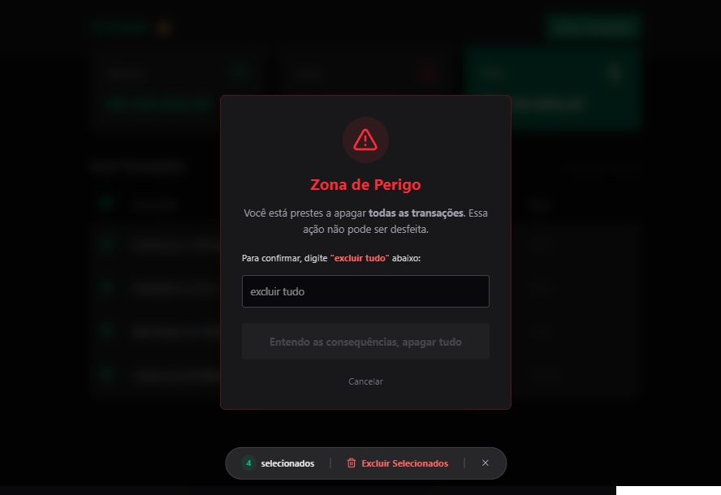

# 💰 FinDash - Dashboard Financeiro

Projeto Fullstack de controle financeiro desenvolvido para gerenciamento de entradas e saídas. O sistema conta com dashboard interativo, exclusão em massa e cálculos em tempo real.

<p align="center">
  
  <br>
  
  <br>
  
</p>

## 🚀 Tecnologias

Esse projeto foi desenvolvido utilizando as melhores práticas do mercado atual (2025/2026):

### Backend (API)
- **Node.js**: Runtime JavaScript.
- **Fastify**: Framework web focado em alta performance.
- **SQLite**: Banco de dados SQL leve e local.
- **CORS**: Segurança de acesso.

### Frontend (Interface)
- **React**: Biblioteca de interfaces.
- **TypeScript**: Superset JS para tipagem estática e segurança.
- **Vite**: Tooling de frontend rápido.
- **Tailwind CSS v4**: Estilização moderna e responsiva.
- **Lucide React**: Biblioteca de ícones.

## ✨ Funcionalidades

- [x] **Dashboard:** Visualização rápida de Entradas, Saídas e Total.
- [x] **Listagem:** Tabela detalhada de transações.
- [x] **Criação:** Modal para adicionar novas receitas ou despesas.
- [x] **Exclusão:** Remover transações individualmente.
- [x] **Batch Delete:** Selecionar múltiplos itens e excluir em massa (UX avançada).
- [x] **Responsividade:** Layout adaptável.

## 📦 Como rodar o projeto

Clone o repositório e siga os passos abaixo:

### 1. Backend
Abra um terminal na pasta `server`:
```bash
cd server
npm install
node index.js
# O servidor rodará na porta 3333
```

### 2. Frontend
Abra outro terminal na pasta web:
```bash
cd web
npm install
npm run dev
# O front rodará na porta 5173
```

Desenvolvido para fins de estudo e portfólio.

### Depois de salvar o arquivo no VS Code:

Volte ao terminal e envie a correção para o GitHub:

```powershell
git add README.md
git commit -m "docs: fix readme formatting"
git push
```


